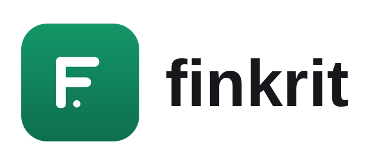

<p align="center">
  <picture>
    <source media="(prefers-color-scheme: dark)" srcset="assets/finkrit-logo-horizontal-dark.png">
    
  </picture>
</p>

Portfolio risk, performance, optimization, and tax analytics. An open core
quant engine, with an optional conversational agent layer and a web dashboard
on top.

## What is in here

finkrit is a small, layered stack, a quant core with Agentic AI, an API, and a web app built on top.

| Path | Import name | What it does |
| - | - | - |
| `packages/finkritq` | `finkritq` | Deterministic quant core. Holdings, tax lots, prices, risk, performance, optimization, and tax. No agent or web dependency. |
| `packages/finkritintel` | `finkritintel` | Tool contracts and capabilities. The bridge that exposes the core as callable tools. |
| `packages/finagent` | `finagent` | Conversational agents over the capabilities, built on pydantic-ai. |
| `services/api/finkritserver` | `finkritserver` | FastAPI layer that serves the JSON API and the built web app. |
| `apps/finkritweb` | (web) | SvelteKit dashboard. Upload a portfolio, see it, ask about it. |

`finkritq` is the open core and stands on its own. Everything above it adds
tools and an agent, and stays optional.

## Quickstart

```bash
git clone https://github.com/finkrit/finkrit
cd finkrit
./run
```

That is the whole thing. On the first run the script creates a virtual
environment, installs the Python and web dependencies, builds the web app,
starts the server, and opens your browser. Later runs skip the setup and start
right away.

Upload a portfolio CSV and explore it. The dashboard and the risk report work
with no key. To turn on upload and chat, set an LLM key first, then run again:

```bash
export LLM_API_KEY=sk-...     # any OpenAI, Anthropic, or Google key
./run
```

Flags pass straight through:

```bash
./run --dev                   # Vite hot reload, for working on the frontend
./run --model openai:gpt-5    # pick the provider and model
```

Prerequisites: Python 3.11 or newer and Node 18 or newer. The script installs
everything else.

## Using the quant core on its own

`finkritq` is the open core, published on its own so you can install just the
quant engine without the agent or web layers.

```bash
pip install finkritq            # core, numpy and scipy only
pip install "finkritq[data]"    # adds the live yfinance data provider
```

From a clone instead of PyPI, put the sources on your path:

```bash
PYTHONPATH=packages python -c "from finkritq.asset import Stock; print(Stock)"
```

## Development

Sources live under `packages/` and `services/api/`. The test runner is
configured to put those on the import path, so a fresh clone runs the suite
with no extra setup.

```bash
pip install -r requirements.txt
pytest                       # the whole suite
pytest packages/finkritq     # one package
```

## Status

Early and moving. The layers above `finkritq` are the newest. Expect the
agent and web surfaces to change while the core settles.

## Disclaimer

finkrit is for educational and informational purposes only. It is not financial,
investment, or tax advice, and nothing it produces is a recommendation to buy or
sell any security. Use your own judgment and consult a licensed professional
before making decisions.

The optional data provider uses [yfinance](https://github.com/ranaroussi/yfinance)
to pull market data from Yahoo Finance. finkrit and yfinance are not affiliated
with, endorsed by, or sponsored by Yahoo. That data is subject to Yahoo's terms
of use and is intended for personal and educational use. Verify anything you rely
on against an authoritative source.

The software is provided as is, without warranty of any kind.

## License

Apache-2.0. See [LICENSE](LICENSE).
