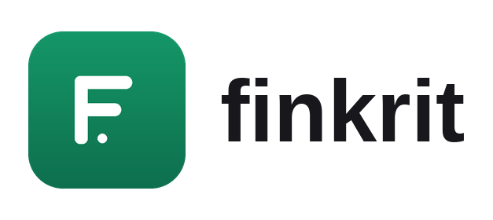

<p align="center">
  <picture>
    <source media="(prefers-color-scheme: dark)" srcset="assets/finkrit-logo-horizontal-dark.png">
    
  </picture>
</p>

Portfolio risk, performance, optimization, and tax analytics. An open core
quant engine, with an optional conversational agent layer and a web dashboard
on top.

## What is in here

finkrit is a small, layered stack, a quant core with Agentic AI, an API, and a web app built on top.

| Path | Import name | What it does |
| - | - | - |
| `packages/finkritq` | `finkritq` | Deterministic quant core. Holdings, tax lots, prices, risk, performance, optimization, and tax. No agent or web dependency. |
| `packages/finkritintel` | `finkritintel` | Tool contracts and capabilities. The bridge that exposes the core as callable tools. |
| `packages/finagent` | `finagent` | Conversational agents over the capabilities, built on pydantic-ai. |
| `services/api/finkritserver` | `finkritserver` | FastAPI layer that serves the JSON API and the built web app. |
| `apps/finkritweb` | (web) | SvelteKit dashboard. Upload a portfolio, see it, ask about it. |

`finkritq` is the open core and stands on its own. Everything above it adds
tools and an agent, and stays optional.

## Quickstart

```bash
pip install finkrit           # or: pipx install finkrit
export LLM_API_KEY=sk-...      # any OpenAI, Anthropic, or Google key
finkrit                        # start the dashboard, opens your browser
```

finkrit wants an LLM key for the chat. The dashboard, the risk report, and a CSV
upload whose header names its columns all run without one. Any provider
pydantic-ai supports works, keyed by the single LLM_API_KEY variable, or pass it
inline with `finkrit --key sk-...`.

Prefer the terminal? `finkrit cli` chats with the agent over a portfolio instead.

## Command line

```
finkrit            start the dashboard (opens your browser)
finkrit web        the same, explicit
finkrit cli        chat with the agent in the terminal
```

The dashboard takes:

```
finkrit --key sk-...           the LLM key inline (should match provider)
finkrit --model openai:gpt-5   pick the provider and model (defaults to openai:gpt-5)
finkrit --url http://host/v1   run against a local model, no key (see Local model)
finkrit --port 8001            serve on a different port
finkrit --dev                  Vite hot reload (source checkout only in case you want to tinker)
```

### Local model

Point the agent at any OpenAI-compatible endpoint (a local Ollama, LM Studio,
vLLM, llama.cpp server, or a self-hosted box) with `--url`. No cloud key is
needed, and you set the model to whatever the endpoint serves:

```bash
finkrit --model llama3.1 --url http://localhost:11434/v1
finkrit cli --model qwen2.5:14b-instruct --url http://my-box.local:8000/v1
```

`--model` names the flag on both entry points. Behind `--url` it is the name
the endpoint serves, verbatim, so an Ollama tag like `qwen2.5:14b-instruct`
goes through whole rather than being read as a provider prefix.

The agent leans on tool calling, so use a tool-capable model (llama 3.1 or 3.3
70B, qwen2.5-instruct, and similar). Small models often fumble the tool calls.
And nothing leaves your machine, so a local model keeps the whole conversation
private.

### Chat with the agent

`finkrit cli` is a REPL over a portfolio. With no `--file` it uses a seeded
offline portfolio, 40 AAPL, 30 MSFT, 20 NVDA, 25 JPM, and 35 XOM, each at a cost
basis of 100 acquired 2022-01-03, priced with deterministic fake data so runs
are reproducible. Point it at your own holdings with a CSV instead, which
switches to live market data:

```bash
finkrit cli --file my_holdings.csv
```

### Try it on the bundled example

No file of your own yet? `example` loads a sample that ships with finkrit, so
this works straight after install:

```bash
finkrit cli --file example
```

It is a twelve position portfolio built from sixteen tax lots, formatted the way
a custodian actually exports: dollar signs, quoted thousands separators, and
`MM/DD/YYYY` dates. Three names were bought more than once, which is the part
worth paying attention to.

Ask it this:

> Which of my lots are sitting at a loss, and what could I harvest?

AAPL is the case the whole lot-level design exists for. It is one holding of 180
shares, and as a single blended position its cost basis is $27,431.50, about
$152.40 a share. At that average the position looks like a straightforward
winner and there is nothing to harvest. But it is really three purchases:

| Lot | Quantity | Cost / share | Acquired |
| - | - | - | - |
| 1 | 100 | $120.40 | 2021-05-12 |
| 2 | 50 | $180.15 | 2023-03-09 |
| 3 | 30 | $212.80 | 2024-06-03 |

The 2024 lot cost nearly twice what the 2021 lot did. Whenever AAPL trades
between those two numbers, that third lot is underwater while the position as a
whole is up, and it is harvestable even though the holding is profitable.
Averaging the lots together makes that loss invisible. UNH has the same shape at
$412.60 against $492.30, and MSFT at $238.60 against $362.45.

Those cost figures come from the file and never change. What the lots are worth
today depends on live prices, so the answer moves with the market.

Worth also trying:

> How much of this portfolio qualifies for long term treatment?

> What is my volatility, and which holding contributes most to it?

The second one fans out to more than one specialist. In the dashboard you can
click each specialist's name on the reply to see exactly what it returned before
the answers were combined.

A CSV file has one row per tax lot, with four columns: ticker, quantity, cost
per share, and acquired date. For example:

| ticker | quantity | cost_per_share | acquired |
| - | - | - | - |
| AAPL | 100 | 120.00 | 2021-05-12 |
| AAPL | 50 | 180.00 | 2023-03-09 |
| MSFT | 95 | 238.60 | 2021-02-18 |
| NVDA | 140 | 168.20 | 2023-03-09 |

**Repeat a ticker for each time you bought it.** AAPL above is one holding of
150 shares made of two lots, and they stay separate all the way through. That
matters for tax, because a position can be up overall while individual lots are
underwater, and those are the ones worth harvesting. Blending them into one
average cost hides exactly the losses you are looking for. Buy once and a single
row is all you need.

Column names are matched case-insensitively against common aliases, so a
typical brokerage export loads without renaming anything:

| Field | Recognized column names |
| - | - |
| Ticker | `ticker`, `symbol` |
| Quantity | `quantity`, `shares`, `qty`, `units` |
| Cost per share | `cost_per_share`, `cost per share`, `cost/share`, `cost basis / share`, `cost basis per share`, `price per share`, `cost basis`, `avg cost`, `average cost basis`, `cost`, `price`, `price paid` |
| Acquired | `acquired`, `date acquired`, `purchase date`, `date` |

Dates accept `YYYY-MM-DD`, `MM/DD/YYYY`, `MM/DD/YY`, or `DD-MM-YYYY`. Commas in
numbers are stripped, extra columns are ignored, and a missing or unreadable
date falls back to a default.

The **web upload** uses that same table. When your header names all four fields
under any of the spellings above, the file is read in code: instantly, with no
model involved and no key needed. Only a file that leaves one of the four
unnamed goes to the model, which maps whatever columns and formats it finds onto
the same four fields and flags anything it had to guess. So almost any layout
works, and a tidy one costs nothing.

What differs between the two is the response to a gap. The terminal substitutes
a default and carries on, since a chat session is throwaway. The upload records
it on the holding for you to correct before anything is saved.

```
-f, --file PATH    load a portfolio CSV, uses live prices
--model openai     provider shortcut, a provider:name string, or a served name
-ag 0|1|2|3|4      router, risk, optimization, performance, tax
--key sk-...       the LLM key
--url URL          an OpenAI compatible endpoint, a local Ollama or LM Studio
--lang Thai        language to answer in, English by default
--logs             show finkritq's data fetch logs, off by default
--steps            also show tool arguments and each specialist's answer
--truncate-steps   cut each step to one terminal row
--quiet            hide the live step trace
```

### The agents

Under the chat sit five agents, four specialists and a router. Each specialist
owns one domain and only that domain's tools.

| Agent | Answers | Covers |
| - | - | - |
| Risk | how risky, what could be lost | volatility, variance, semivariance, downside deviation, drawdown and maximum drawdown, value at risk and conditional VaR, beta, and each holding's marginal and component contribution to risk |
| Performance | how it has done | total return, annualized return, and the risk-adjusted Sharpe, Sortino, and Calmar ratios |
| Optimization | what to hold | the minimum-variance and maximum-Sharpe target weights, long only, and a tax-aware rebalance plan toward them: sells chosen drift first, lots picked to minimize the gain, capped by a capital gains budget. Can compare strategies side by side, selling fully to target, only to the band edge, or partially filling to exactly spend the budget, each with its tax cost and remaining drift. Proposed allocations and plans, never trades |
| Tax | what the IRS sees | unrealized gains and losses per lot, tax-loss harvesting candidates net of the wash sale window, and the long versus short term split. Read only, describes the tax position and never trades |
| Orchestrator | anything, mixed | reads the question, calls whichever specialists can answer, and combines their replies into one |

Target a single specialist with `-ag`, by number or by name:

```bash
finkrit cli -ag 1                # risk
finkrit cli -ag performance      # same as -ag 3
finkrit cli --agent optimization
```

Numbers are `0` router, `1` risk, `2` optimization, `3` performance, `4` tax. Left off,
the CLI shows a menu. A single specialist is the direct path, the model sees
only that domain's tools and answers with no routing overhead, so pick one when
you already know the domain.

**How the orchestrator works.** The router (agent `0`) is itself an agent whose
tools each hand a focused sub-question to one specialist. It reads your question,
decides which specialists it needs, calls them (one or several), and synthesizes
a single answer. So a mixed question in one message, for example "what is my
volatility, my annualized return, and the optimal weights?", fans out to those
three and comes back combined. It never invents or alters a number, it reports
only what a specialist returned. The tradeoff is one extra model loop around the
specialists it invokes, which is why a single specialist is cheaper when the
domain is known.

The **web dashboard always routes through the orchestrator**, so any question,
risk, performance, or allocation, reaches the right specialist without you
choosing one.

## From source

To hack on finkrit, clone it and use the bootstrap, which sets up a virtual
environment, installs dependencies, builds the web app, and launches.

```bash
git clone https://github.com/finkrit/finkrit
cd finkrit
export LLM_API_KEY=sk-...
./run                          # same flags as finkrit web, for example --dev
```

Prerequisites: Python 3.11 or newer and Node 18 or newer. Later runs skip the
setup.

`./run` starts the web app. For the terminal chat against your working tree,
install the checkout into its own environment so the `finkrit` command exists
and points at your source rather than at the published wheel:

```bash
source .finkritvenv/bin/activate
pip install -e .
finkrit cli --file example       # now runs the code you are editing
```

Without that install there is no `finkrit` on the path, since the bootstrap
only installs dependencies. Activating the environment does not help on its
own, and the error is a bare `command not found`. To skip the install
entirely, call the module and let the checkout put its siblings on the path:

```bash
python -c "import finkrit; from finagent.cli import main; main()" --file example
```

One thing the editable install does not cover: `finkritintel` and `finkritq`
still come from PyPI, so only `finagent` and `finkrit` track your edits. Change
either of the lower two packages and you are testing the published version of
it, not yours.

## Using the quant core on its own

`finkritq` is the open core, published on its own so you can install just the
quant engine without the agent or web layers.

```bash
pip install finkritq            # core, numpy and scipy only
pip install "finkritq[data]"    # adds the live yfinance data provider
```

It also ships a runnable demo that prints every analytic pillar over a
portfolio, no agent involved:

```bash
python -m finkritq                                             # seeded, offline
python -m finkritq real NVDA KO PG --benchmark SPY --years 3   # needs [data]
```

## Development

Sources live under `packages/` and `services/api/`. The test runner is
configured to put those on the import path, so a fresh clone runs the suite
with no extra setup.

```bash
pip install -r requirements.txt
pytest                       # the whole suite
pytest packages/finkritq     # one package
```

## Status

Early and moving. The layers above `finkritq` are the newest. Expect the
agent and web surfaces to change while the core settles.

## Disclaimer

finkrit is for educational and informational purposes only. It is not financial,
investment, or tax advice, and nothing it produces is a recommendation to buy or
sell any security. Use your own judgment and consult a licensed professional
before making decisions.

The optional data provider uses [yfinance](https://github.com/ranaroussi/yfinance)
to pull market data from Yahoo Finance. finkrit and yfinance are not affiliated
with, endorsed by, or sponsored by Yahoo. That data is subject to Yahoo's terms
of use and is intended for personal and educational use. Verify anything you rely
on against an authoritative source.

The software is provided as is, without warranty of any kind.

## License

Apache-2.0. See [LICENSE](LICENSE).
