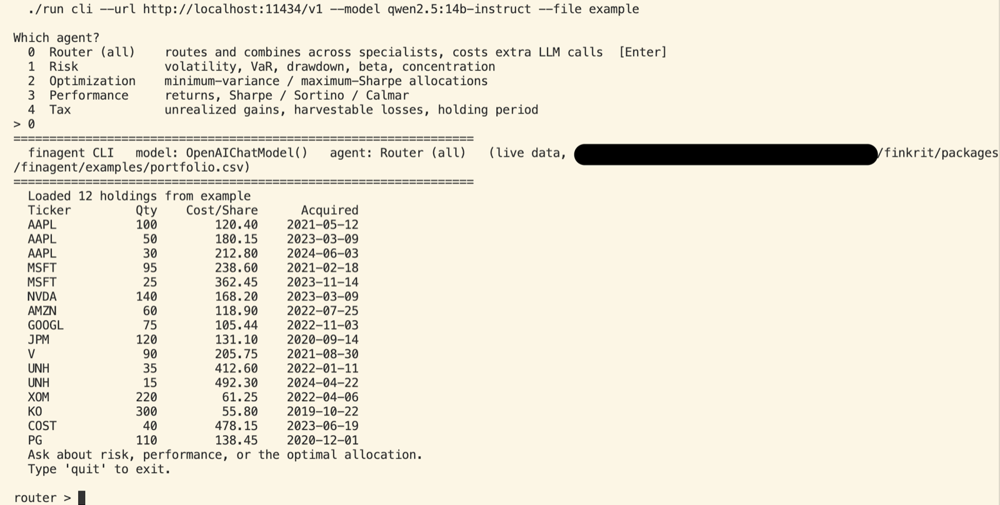
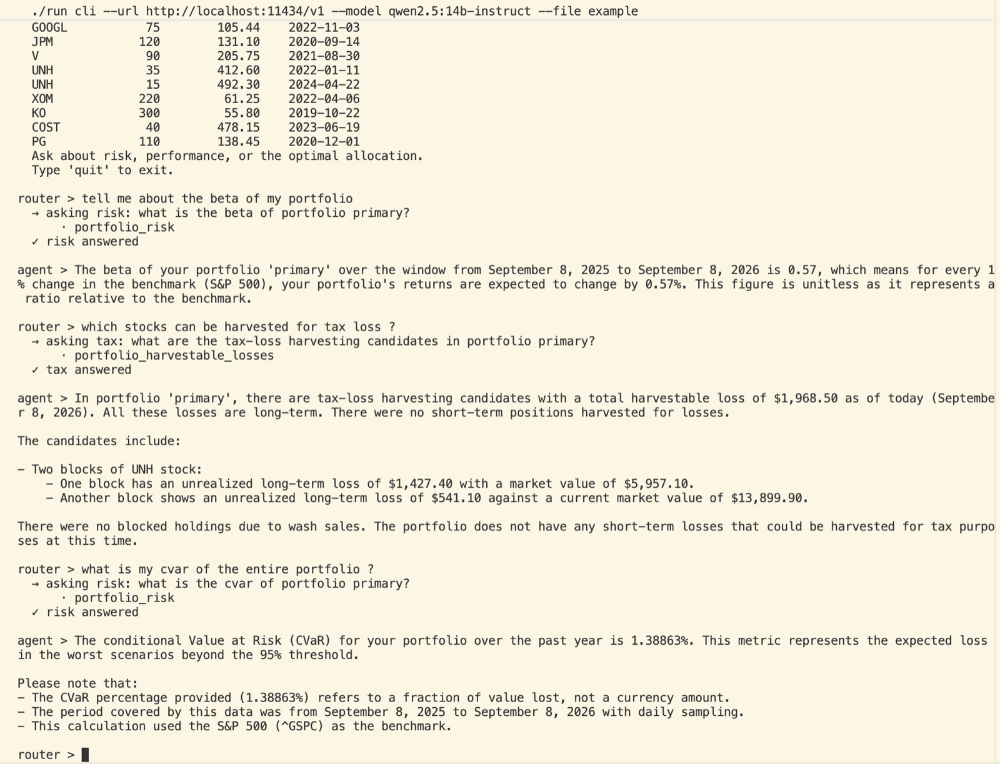
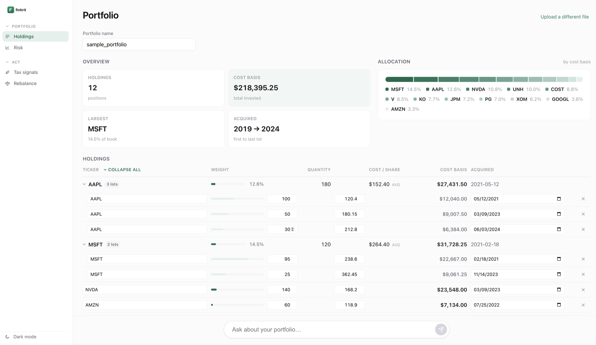
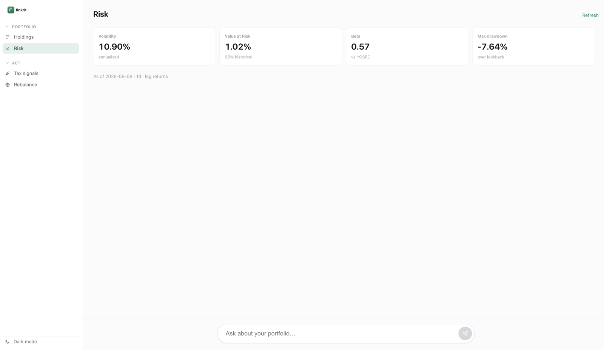
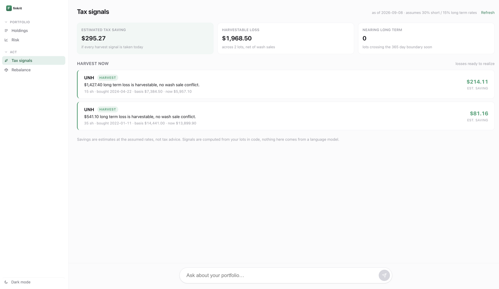
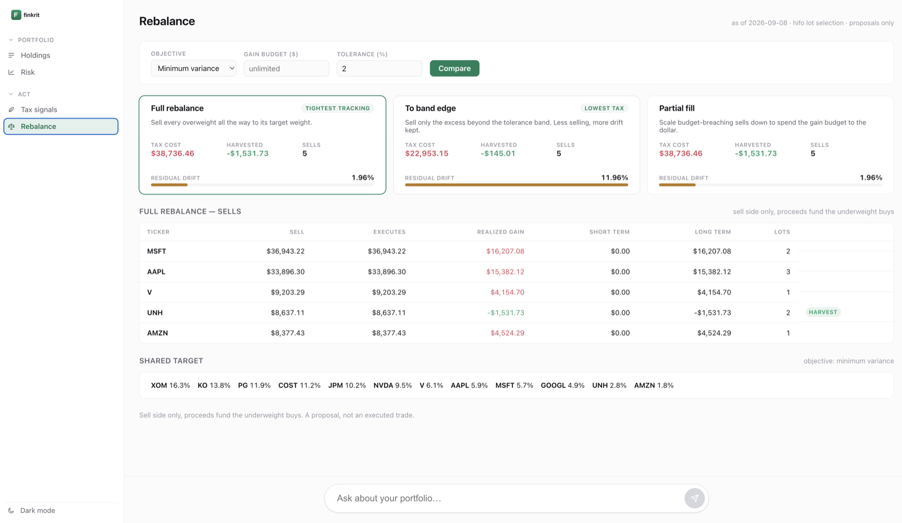
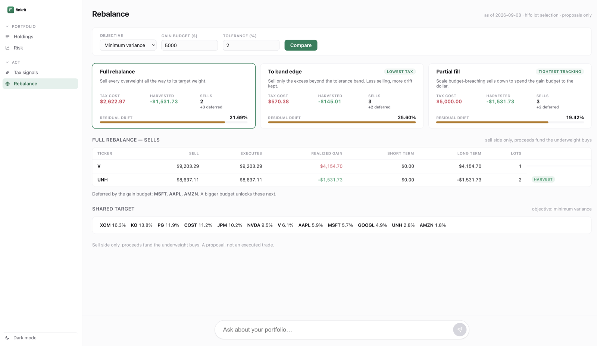
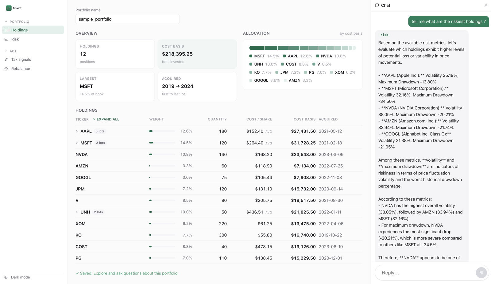
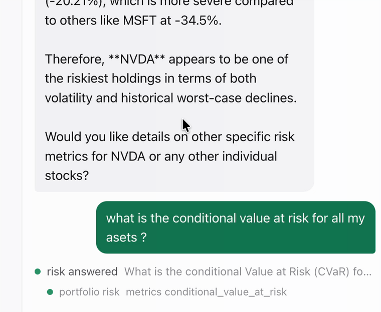

<p align="center">
  <picture>
    <source media="(prefers-color-scheme: dark)" srcset="assets/finkrit-logo-horizontal-dark.png">
    
  </picture>
</p>

Portfolio risk, performance, optimization, and tax analytics. An open core
quant engine, with an optional conversational agent layer and a web dashboard
on top.

## Ask a real portfolio question

> Which holdings in my portfolio are the riskiest?

finkrit separates the dimensions of risk instead of forcing them into one score.
In the bundled portfolio, NVDA has the highest annualized volatility at 38.05%,
while MSFT has the deepest maximum drawdown at -34.50%. AMZN is next by
volatility at 33.94%. The agent explains the distinction and shows the metrics
behind the answer, so you can decide whether volatility, downside history, or
both matter for the decision at hand.


https://github.com/user-attachments/assets/aa26a18a-dc8f-4f3e-8dc2-f1833fb9baaf


## Try it on the bundled example

No file of your own yet? `example` loads a sample that ships with finkrit, so
this works straight after install:

```bash
finkrit cli --file example

# against a local model, no key needed
finkrit cli --file example --url http://localhost:11434/v1 --model qwen2.5:14b-instruct

# from a source checkout, where finkrit is not on the path
./run cli --file example --url http://localhost:11434/v1 --model qwen2.5:14b-instruct
```

It opens by asking which agent to use, then prints what it parsed so you can
check the file was read the way you meant. One row per tax lot, not per holding,
which is the distinction the whole design turns on:

<p align="center">
  
</p>

Then ask it things. Pick `0` for the router and it works out which specialist
each question belongs to, showing the sub question it delegated, the tool that
ran, and the answer that came back:

<p align="center">
  
</p>

Note what the answers state without being asked: that beta is unitless, that
CVaR is a fraction of value rather than a currency amount, the exact window the
figures cover, and which benchmark was used. Those come from the tool results
rather than from the model, which is what stops a small model reporting a
fraction as a dollar figure.

It is a twelve position portfolio built from sixteen tax lots, formatted the way
a custodian actually exports: dollar signs, quoted thousands separators, and
`MM/DD/YYYY` dates. Three names were bought more than once, which is the part
worth paying attention to.

Ask it this:

> Which of my lots are sitting at a loss, and what could I harvest?

AAPL is the case the whole lot level design exists for. It is one holding of 180
shares, and as a single blended position its cost basis is $27,431.50, about
$152.40 a share. At that average the position looks like a straightforward
winner and there is nothing to harvest. But it is really three purchases:

| Lot | Quantity | Cost / share | Acquired |
| - | - | - | - |
| 1 | 100 | $120.40 | 2021-05-12 |
| 2 | 50 | $180.15 | 2023-03-09 |
| 3 | 30 | $212.80 | 2024-06-03 |

The 2024 lot cost nearly twice what the 2021 lot did. Whenever AAPL trades
between those two numbers, that third lot is underwater while the position as a
whole is up, and it is harvestable even though the holding is profitable.
Averaging the lots together makes that loss invisible. UNH has the same shape at
$412.60 against $492.30, and MSFT at $238.60 against $362.45.

Those cost figures come from the file and never change. What the lots are worth
today depends on live prices, so the answer moves with the market.

Worth also trying:

> How much of this portfolio qualifies for long term treatment?

> What is my volatility, and which holding contributes most to it?

The second one fans out to more than one specialist. In the dashboard you can
click each specialist's name on the reply to see exactly what it returned before
the answers were combined.

A CSV file has one row per tax lot, with four columns: ticker, quantity, cost
per share, and acquired date. For example:

| ticker | quantity | cost_per_share | acquired |
| - | - | - | - |
| AAPL | 100 | 120.00 | 2021-05-12 |
| AAPL | 50 | 180.00 | 2023-03-09 |
| MSFT | 95 | 238.60 | 2021-02-18 |
| NVDA | 140 | 168.20 | 2023-03-09 |

**Repeat a ticker for each time you bought it.** AAPL above is one holding of
150 shares made of two lots, and they stay separate all the way through. That
matters for tax, because a position can be up overall while individual lots are
underwater, and those are the ones worth harvesting. Blending them into one
average cost hides exactly the losses you are looking for. Buy once and a single
row is all you need.

Column names are matched case insensitively against common aliases, so a
typical brokerage export loads without renaming anything:

| Field | Recognized column names |
| - | - |
| Ticker | `ticker`, `symbol` |
| Quantity | `quantity`, `shares`, `qty`, `units` |
| Cost per share | `cost_per_share`, `cost per share`, `cost/share`, `cost basis / share`, `cost basis per share`, `price per share`, `cost basis`, `avg cost`, `average cost basis`, `cost`, `price`, `price paid` |
| Acquired | `acquired`, `date acquired`, `purchase date`, `date` |
| Name (optional) | `description`, `name`, `security`, `security name`, `company`, `company name` |

The first four are what a file must label. Name is read when it is there and
skipped when it is not, so a file without it still loads. It is worth having:
most exports print the security next to its symbol, and an agent handed a bare
ticker will supply a company name from memory and can get it wrong.

Dates accept `YYYY-MM-DD`, `MM/DD/YYYY`, `MM/DD/YY`, or `DD-MM-YYYY`. Commas in
numbers are stripped, extra columns are ignored, and a missing or unreadable
date falls back to a default.

The **web upload** uses that same table. When your header names all four fields
under any of the spellings above, the file is read in code: instantly, with no
model involved and no key needed. Only a file that leaves one of the four
unnamed goes to the model, which maps whatever columns and formats it finds onto
the same four fields and flags anything it had to guess. So almost any layout
works, and a tidy one costs nothing.

What differs between the two is the response to a gap. The terminal substitutes
a default and carries on, since a chat session is throwaway. The upload records
it on the holding for you to correct before anything is saved.

## The web app

`finkrit` with no subcommand builds the dashboard, serves it, and opens your
browser at `http://127.0.0.1:8000`:

```bash
finkrit

# on a local model, no key
finkrit --url http://localhost:11434/v1 --model qwen2.5:14b-instruct

# from a source checkout
./run --url http://localhost:11434/v1 --model qwen2.5:14b-instruct
```

### Your book, lot by lot

Upload a CSV and it parses into positions and the lots underneath them. The
overview counts positions rather than rows, allocation is by cost basis, and
every field in the table is editable in place before you commit it with **Save
portfolio**.

<p align="center">
  
</p>

### Risk

Volatility, value at risk, beta and maximum drawdown, computed in code with no
model anywhere in the request. The line under the cards states the as of date,
the sampling interval and that these are log returns, so the numbers are never
floating free of the window they came from. First load fetches prices for every
holding plus the benchmark and reports progress per ticker.

<p align="center">
  
</p>

### Tax signals

Every lot trading below cost and clear of the wash sale window, priced at your
assumed rates so the saving is a dollar figure rather than a hint. Each card
names the lot, what it cost, what it is worth now, and what realizing it would
save. As the footer on that screen puts it, the signals are computed from your
lots in code and nothing there comes from a language model.

<p align="center">
  
</p>

### Rebalance

Three strategies run against the same target and the same budget, so the
tradeoff between tax paid and drift left is a table instead of an argument. With
no gain budget, every overweight sells the whole way and the tax bill is
whatever it is:

<p align="center">
  
</p>

Set a budget and the plan spends it to the dollar. The same comparison at
$5,000 sells two names instead of five, names the three it deferred, and the
residual drift jumps from 1.96% to 21.69%, which is the price of the smaller
tax bill stated rather than implied:

<p align="center">
  
</p>

### Ask it anything

The chat panel opens beside whatever you are looking at and routes through the
orchestrator, so a question reaches the right specialist without you picking
one. The pill above each reply names the specialist that answered, and clicking
it shows what that specialist returned before the answers were combined.

<p align="center">
  
</p>

Asked in a fresh turn, the CVaR answer states the figure, that it is a fraction of
value rather than a currency amount, the confidence level, and the exact window it
was computed over. None of that came from the model. It came from the tool result:

<p align="center">
  
</p>

## What is in here

finkrit is a small, layered stack, a quant core with Agentic AI, an API, and a web app built on top.

| Path | Import name | What it does |
| - | - | - |
| `packages/finkritq` | `finkritq` | Deterministic quant core. Holdings, tax lots, prices, risk, performance, optimization, and tax. No agent or web dependency. |
| `packages/finkritintel` | `finkritintel` | Tool contracts and capabilities. The bridge that exposes the core as callable tools, framework neutral. |
| `packages/finkritcore` | `finkritcore` | Deterministic domain layer. The store, the report composers, and the CSV mapper, tied together behind a `Desk`. No agent framework, so the dashboard and the reports run without one. |
| `packages/finagent` | `finagent` | Conversational agents over the capabilities, built on pydantic-ai. |
| `services/api/finkritserver` | `finkritserver` | FastAPI layer that serves the JSON API and the built web app. |
| `apps/finkritweb` | (web) | SvelteKit dashboard. Upload a portfolio, see it, ask about it. |

`finkritq` is the open core and stands on its own. Everything above it adds
tools and an agent, and stays optional.

The layering is a graph rather than a stack. `finkritintel` and `finkritcore`
are siblings on top of `finkritq`, answering two different questions: intel is
what the system can *compute*, core is what a client *holds*. `finagent` stands
on both. `tests/test_layering.py` walks the shipped source and fails the suite
if a lower layer ever imports an upper one, so the rule is enforced rather than
described.

## Quickstart

```bash
pip install finkrit           # or: pipx install finkrit
export LLM_API_KEY=sk-...      # any OpenAI, Anthropic, or Google key
finkrit                        # start the dashboard, opens your browser
```

finkrit wants an LLM key for the chat. The dashboard, the risk report, and a CSV
upload whose header names its columns all run without one. Any provider
pydantic-ai supports works, keyed by the single LLM_API_KEY variable, or pass it
inline with `finkrit --key sk-...`.

Prefer the terminal? `finkrit cli` chats with the agent over a portfolio instead.

## Command line

```
finkrit            start the dashboard (opens your browser)
finkrit web        the same, explicit
finkrit cli        chat with the agent in the terminal
```

The dashboard takes:

```
finkrit --key sk-...           the LLM key inline (should match provider)
finkrit --model openai:gpt-5   pick the provider and model (defaults to openai:gpt-5)
finkrit --url http://host/v1   run against a local model, no key (see Local model)
finkrit --port 8001            serve on a different port
finkrit --dev                  Vite hot reload (source checkout only in case you want to tinker)
```

### Local model

Point the agent at any OpenAI compatible endpoint (a local Ollama, LM Studio,
vLLM, llama.cpp server, or a self hosted box) with `--url`. No cloud key is
needed, and you set the model to whatever the endpoint serves:

```bash
# a local Ollama, the usual case
finkrit --model qwen2.5:14b-instruct --url http://localhost:11434/v1
finkrit cli --model qwen2.5:14b-instruct --url http://localhost:11434/v1

# a box elsewhere on your network. YOUR-HOST is a placeholder, substitute it
finkrit cli --model qwen2.5:14b-instruct --url http://YOUR-HOST:8000/v1
```

From a source checkout, where `finkrit` is not on the path, `./run` takes the
same arguments:

```bash
./run cli --model qwen2.5:14b-instruct --url http://localhost:11434/v1 --file example
```

`--model` names the flag on both entry points. Behind `--url` it is the name
the endpoint serves, verbatim, so an Ollama tag like `qwen2.5:14b-instruct`
goes through whole rather than being read as a provider prefix.

The agent leans on tool calling, so use a tool capable model (llama 3.1 or 3.3
70B, qwen2.5-instruct, and similar). Small models often fumble the tool calls.
And nothing leaves your machine, so a local model keeps the whole conversation
private.

### Chat with the agent

`finkrit cli` is a REPL over a portfolio. With no `--file` it uses a seeded
offline portfolio, 40 AAPL, 30 MSFT, 20 NVDA, 25 JPM, and 35 XOM, each at a cost
basis of 100 acquired 2022-01-03, priced with deterministic fake data so runs
are reproducible. Point it at your own holdings with a CSV instead, which
switches to live market data:

```bash
finkrit cli --file my_holdings.csv
```

Every flag the CLI takes:

```
-f, --file PATH      a portfolio CSV, or 'example' for the bundled sample.
                     Left off, the seeded offline portfolio is used
-ag, --agent N       0 router, 1 risk, 2 optimization, 3 performance, 4 tax,
                     or the name. Left off, a menu asks
--model NAME         provider shortcut (claude, openai, gemini, groq, mistral),
                     a full provider:name string, or the served name behind --url
--url URL            an OpenAI compatible endpoint, a local Ollama, LM Studio,
                     vLLM or self hosted box. No key needed
--key sk-...         the LLM key inline, instead of the LLM_API_KEY env var
--lang NAME          language to answer in, English by default
--steps              also show each tool's arguments and each specialist's answer
--truncate-steps     cut each step to one terminal row, for a narrow terminal
--quiet              hide the live step trace entirely
--logs               print finkritq's data fetch logs, every download and cache hit
```

### The agents

Under the chat sit five agents, four specialists and a router. Each specialist
owns one domain, and no tools outside it.

| Agent | Answers | Covers |
| - | - | - |
| Risk | how risky, what could be lost | volatility, variance, semivariance, downside deviation, drawdown and maximum drawdown, value at risk and conditional VaR, beta, and each holding's marginal and component contribution to risk |
| Performance | how it has done | total return, annualized return, and the risk adjusted Sharpe, Sortino, and Calmar ratios |
| Optimization | what to hold | the minimum variance and maximum Sharpe target weights, long only, and a tax aware rebalance plan toward them: sells chosen drift first, lots picked to minimize the gain, capped by a capital gains budget. Can compare strategies side by side, selling fully to target, just to the band edge, or partially filling to exactly spend the budget, each with its tax cost and remaining drift. Proposed allocations and plans, never trades |
| Tax | what the IRS sees | unrealized gains and losses per lot, tax loss harvesting candidates net of the wash sale window, and the long versus short term split. Read only, describes the tax position and never trades |
| Orchestrator | anything, mixed | reads the question, calls whichever specialists can answer, and combines their replies into one |

Target a single specialist with `-ag`, by number or by name:

```bash
finkrit cli -ag 1                # risk
finkrit cli -ag performance      # same as -ag 3
finkrit cli --agent optimization
```

Numbers are `0` router, `1` risk, `2` optimization, `3` performance, `4` tax. Left off,
the CLI shows a menu. A single specialist is the direct path, the model sees
that domain's tools and answers with no routing overhead, so pick one when
you already know the domain.

**How the orchestrator works.** The router (agent `0`) is itself an agent whose
tools each hand a focused sub question to one specialist. It reads your question,
decides which specialists it needs, calls them (one or several), and synthesizes
a single answer. So a mixed question in one message, for example "what is my
volatility, my annualized return, and the optimal weights?", fans out to those
three and comes back combined. It never invents or alters a number, and it
reports what a specialist returned and nothing besides. The tradeoff is one
extra model loop around the specialists it invokes, which is why a single
specialist is cheaper when the domain is known.

When exactly one specialist answered, its reply reaches you word for word rather
than being rewritten. There is nothing to combine in that case, so the
orchestrator's closing text would be a second pass over numbers it was told not
to touch, which is where two observed failures came from: a beta restated as
-0.05 where the specialist had said -0.06, and a Chinese answer summarized into
Thai while the model was instructed in English. A question that genuinely spans
specialists is still combined, because there the synthesis is the work.

The **web dashboard always routes through the orchestrator**, so any question,
risk, performance, or allocation, reaches the right specialist without you
choosing one.

### Follow up questions

Both the terminal and the dashboard carry the conversation forward, so pronouns
and refinements work:

```
> betas of my holdings
> and in dollars?
> which of those is riskiest
```

History is the message thread of the top level agent. A specialist's internal
tool loop happens inside a single tool call and never enters it, so the thread
reads like the conversation you actually had. It is capped at forty user turns
and trimmed at turn boundaries, never between a tool call and its result.

### Where the numbers come from

Two rules hold the whole stack up, and both are enforced rather than requested.

The model may route, read and explain, but it never authors a number. Every
figure comes back from a `finkritq` function it can call and cannot write.

Then the answer is read back before you see it. Each figure in the reply has to
be a faithful rendering of some number the run actually received, where faithful
allows rounding, converting a fraction to a percentage, and thousands
separators, and does not allow a digit that changes. An unsupported figure is
sent back to the model with the offending numbers named. If it will not correct
itself the answer arrives annotated rather than silently wrong.

## From source

To hack on finkrit, clone it and use the bootstrap, which sets up a virtual
environment, installs dependencies, builds the web app, and launches.

```bash
git clone https://github.com/finkrit/finkrit
cd finkrit
export LLM_API_KEY=sk-...
./run                          # same flags as finkrit web, for example --dev
```

Prerequisites: Python 3.11 or newer and Node 18 or newer. Later runs skip the
setup.

`./run` takes the same subcommands the installed `finkrit` command does, so a
checkout reaches the terminal chat without installing anything:

```bash
./run                            # the dashboard
./run cli --file example         # the terminal chat, against your working tree
./run cli --file example --url http://localhost:11434/v1 --model qwen2.5:14b-instruct
```

Every flag documented above works after the subcommand, and `./run` always runs
the code you are editing rather than the published wheel.

Note that `finkrit` itself is not on the path in a fresh checkout, since the
bootstrap installs dependencies rather than the project, and activating the
environment does not change that. The error is a bare `command not found`. Use
`./run` as above, or put the command on the path with an editable install:

```bash
source .finkritvenv/bin/activate
pip install -e .
finkrit cli --file example
```

One thing the editable install does not cover: `finkritintel` and `finkritq`
still come from PyPI, so `finagent` and `finkrit` are what track your edits. Change
either of the lower two packages and you are testing the published version of
it, not yours.

## Using the quant core on its own

`finkritq` is the open core, published on its own so you can install just the
quant engine without the agent or web layers.

```bash
pip install finkritq            # core, numpy and scipy only
pip install "finkritq[data]"    # adds the live yfinance data provider
```

It also ships a runnable demo that prints every analytic pillar over a
portfolio, no agent involved:

```bash
python -m finkritq                                             # seeded, offline
python -m finkritq real NVDA KO PG --benchmark SPY --years 3   # needs [data]
```

## Development

Sources live under `packages/` and `services/api/`. The test runner is
configured to put those on the import path, so a fresh clone runs the suite
with no extra setup.

```bash
pip install -r requirements.txt
pytest                       # the whole suite
pytest packages/finkritq     # one package
```

## Status

Early and moving. The layers above `finkritq` are the newest. Expect the
agent and web surfaces to change while the core settles.

## Disclaimer

finkrit is for educational and informational purposes only. It is not financial,
investment, or tax advice, and nothing it produces is a recommendation to buy or
sell any security. Use your own judgment and consult a licensed professional
before making decisions.

The optional data provider uses [yfinance](https://github.com/ranaroussi/yfinance)
to pull market data from Yahoo Finance. finkrit and yfinance are not affiliated
with, endorsed by, or sponsored by Yahoo. That data is subject to Yahoo's terms
of use and is intended for personal and educational use. Verify anything you rely
on against an authoritative source.

The software is provided as is, without warranty of any kind.

## License

Apache-2.0. See [LICENSE](LICENSE).
